# PostgreSQL Data Provider Plugin for Inji Certify

A plugin for Inji Certify that enables credential issuance using PostgreSQL data sources.

## Features

* Parameterized SQL query execution
* Automatic JSON transformation of database results
* Integration with Inji Certify for VC issuance

## Prerequisites

* Java 21
* PostgreSQL (The database has to be same as the one used with Inji Certify)
* Inji Certify v0.10.x


## Workflow

```mermaid
sequenceDiagram
    participant Client as 🌐 Client
    box Inji Certify #E6F3FF
    participant credential_endpoint as 🔗 Credential API
    participant VelocityEngine as ⚙️ Template Engine
    participant VCSigner as 🔏 VC Signer
    participant TemplateDB as 💾 Template Store
    end
    box PostgreSQL Data Provider Plugin #FFE6E6
    participant DataProvider as 🔌 Data Provider
    end
    participant PostgresDB as 💾 PostgreSQL DB

    Client->>credential_endpoint: Request VC Issuance (OIDC4VCI)
    
    credential_endpoint->>DataProvider: Request Data (parameters)
    
    DataProvider->>PostgresDB: Establish Connection
    PostgresDB-->>DataProvider: Connection Established
    
    DataProvider->>PostgresDB: Execute SQL Query
    Note right of PostgresDB: Query processes<br/>with parameters
    PostgresDB-->>DataProvider: Return Result Set
    
    DataProvider->>DataProvider: Convert to JSONObject
    Note right of DataProvider: Transform DB results<br/>to JSON format
    
    DataProvider->>PostgresDB: Close Connection
    DataProvider-->>credential_endpoint: Return JSONObject
    
    credential_endpoint->>TemplateDB: Fetch Credential Template
    TemplateDB-->>credential_endpoint: Return Template
    
    credential_endpoint->>VelocityEngine: Process Template with JSON Data
    VelocityEngine-->>credential_endpoint: Return unsigned Credential Data
    
    credential_endpoint->>VCSigner: Sign Credential
    Note right of VCSigner: Sign VC
    VCSigner-->>credential_endpoint: Return Signed VC
    
    credential_endpoint-->>Client: Return Final VC (OIDC4VCI)
```



1. **Client Request**: Initiate VC request via OIDC4VCI protocol
2. **Data Fetching**:
    * Credential API calls PostgreSQL Data Provider
    * Secure connection established with database
    * Parameterized SQL query executed
    * Results converted to JSON format
3. **Credential Generation**:
    * Template engine merges data with credential template
    * VC Signer adds cryptographic proofs
4. **Response**: Signed VC returned to client


## Configuration docs for Postgres Plugin

- Pre-requisites
  - Authorisation Provider should expose the unique identifier in the `sub` field of the JWT token.
      Eg. If one is using eSignet with mock-identity-system:0.10.0 and above it can be achieved by setting:
      ```mosip.mock.ida.kyc.psut.field=individualId```
      where individualId will be the identifier to locate the identity in the expected identity registry.
  - Refer to an existing table or create a new table referring data of a specific usecase.

1. The schema context containing all the required fields should be hosted in a public url.
    - Refer this link for an existing context: [Registration Receipt Schema](https://mosip.github.io/inji-config/dev1/registration-receipt-context.json)
      Eg: https://<username>.github.io/<project_name>/<file_name>.json
    - Also change the respective credential name:
      ```
         {
             "@context": {
                 "@version": 1.1,
                 "@protected": true,
                 "type": "@type",
                 "schema": "https://schema.org/",
                 "<credential_name>": {
                     "@id": "https://<username>.github.io/<project_name>/<file_name>.json#<credential_name>"
                 },
                 <field1>: "schema:<type>"
                 <field2>: "schema:<type>"
                 ...
             }
         }
      ```
    - When the authentication is done using this particular identifier then the record from certify tables can be fetched by the postgres plugin and returned as a JSON Object.

2. For referring the table creation and template insertion, see the sql scripts under db_scripts/mosip_certify/ddl folder of inji_certify: [db_scripts](https://github.com/mosip/inji-certify/tree/master/db_scripts/mosip_certify/ddl)

3. inji-config changes:
    - Refer to the properties file in [inji-config](https://github.com/mosip/inji-config) that corresponds to the postgres plugin implementation.
      [Certify Postgres Land Registry](https://github.com/mosip/inji-config/blob/develop/certify-postgres-landregistry.properties)
    - The value for the property `mosip.certify.integration.data-provider-plugin` must be set to `PostgresDataProviderPlugin`
    - Refer to the below property for setting the query value against the scope for the credential that is to be issued:
       ```
      mosip.certify.data-provider-plugin.postgres.scope-query-mapping={
         `credential_scope`: `select * from certify.<table_name> where <table_id>=:id`
       }
      ```
    - Add the scope defined above and the type of credential in the well-known config of the properties file. Refer to the property `mosip.certify.key-values` for the same.
    - Add the fields from the respective table in the well-known config.

4. Authorization Server config changes:
    - Add the required scopes to the supported credential scopes which refers to the scope in the scope-query-mapping in the 3rd point.
    - Also add the above scopes wherever necessary so that authentication can be carried out with the particular scopes.